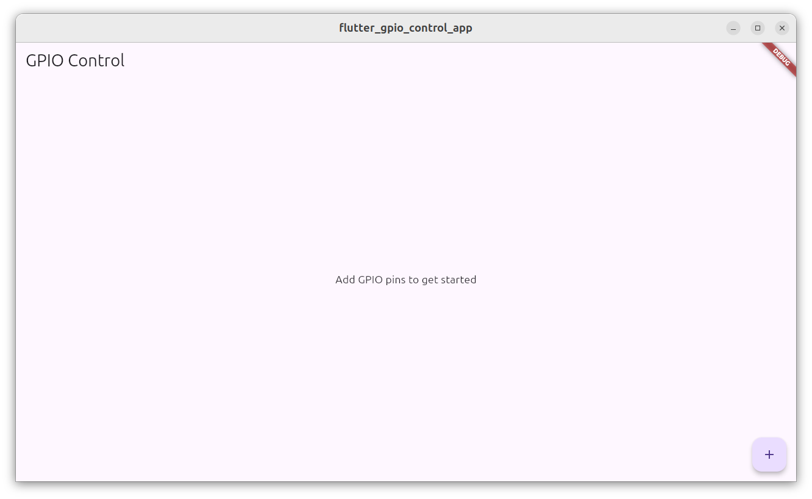
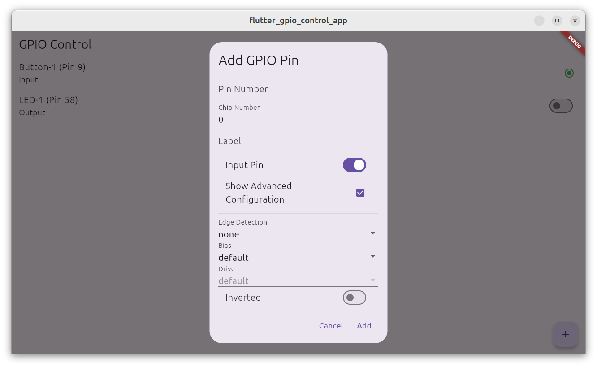
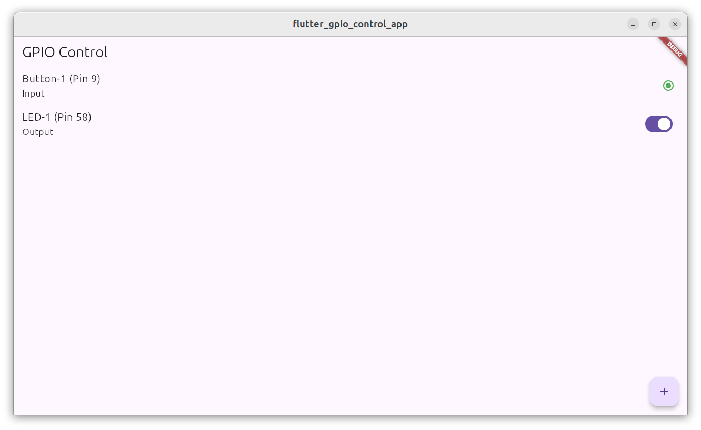

# Flutter GPIO Control App
This is a Flutter application for controlling GPIO pins. The application implements clean architecture and uses the `flutter_bloc` package for state management. The application provides a user interface to interact with GPIO pins.

## Features
   - Add new GPIO pins (input or output) with advanced configuration options
   - Toggle output pins
   - Monitor input pins
   - Visual feedback for pin states
   - GPIO pins will be properly closed in these scenarios:
      - When the app is terminated
      - When the app is minimized or hidden
      - When the user explicitly tries to close the app

## Usage
- Click the `+` button to add a new pin
- Fill in the basic information (pin number and label)
- Toggle `Show Advanced Configuration` to see additional options
- Select the desired configuration options
- Click `Add` to create the pin with the selected configuration
- The UI will now show the configuration details in the expanded view of each pin.

## Screenshots
  

## Platform Support
| Android |  iOS  | MacOS |  Web  | Linux | Windows |
| :-----: | :---: | :---: | :---: | :---: | :-----: |
|   ❌   |   ❌   |   ❌   |   ❌ |   ✅    |    ❌   |

## Dependencies
- [flutter_bloc](https://pub.dev/packages/flutter_bloc): State management library for Flutter applications.
- [dart_periphery](https://pub.dev/packages/dart_periphery): Dart package for controlling GPIO pins.

## Hardware Requirements
- A Linux machine with GPIO pins
   - UI maybe be a bit laggy on Raspberry Pi 4B
   - Raspberry Pi 5 or more powerful SBC recommended
- Jumper wires for connecting to GPIO pins
- External devices to control or monitor (e.g., LEDs, buttons)

## Getting Started

### Prerequisites

- Flutter SDK: [Install Flutter](https://docs.flutter.dev/get-started/install/linux/desktop)
- Dart SDK: Included with Flutter
- CMake: Required for building the Linux application
- gpiod: Required for controlling GPIO pins on Linux
   - Install the `gpiod` package:
      ```bash
      $ sudo apt-get install gpiod
      ```
   - Add permissions for GPIO pins:
      ```bash
      $ sudo groupadd gpiod
      $ sudo usermod -aG gpiod ${USER}
      ``` 
      ```bash
      $ sudo nano /etc/udev/rules.d/60-gpiod.rules
      ```
      - add the following:
      ```bash
      # udev rules for gpio port access through libgpiod
      SUBSYSTEM=="gpio", KERNEL=="gpiochip*", GROUP="gpiod", MODE="0660"
      ```
      - reboot the system
   

### Installation

1. Clone the repository:
   ```sh
   git clone https://github.com/IoT-gamer/flutter_gpio_control_app.git
   cd flutter_gpio_control_app
   ```

2. Install dependencies:
   ```sh
   flutter pub get
   ```

### Running the Application

To run the application on Linux, use the following command:
```sh
flutter run -d linux
```

### Project Structure

- [main.dart](lib/main.dart): Entry point of the application.
- [gpio_control](lib/features/gpio_control): Contains the main features of the application.
  - `device/`: Hardware interaction layer (GPIO Pins) including repositories.
  - `domain/`: Domain layer including use cases.
  - `presentation/`: Presentation layer including UI and state management.

### Building for Linux

The Linux build configuration is managed using CMake. The build process is defined in the [build.ninja](build/linux/x64/debug/build.ninja) file.

